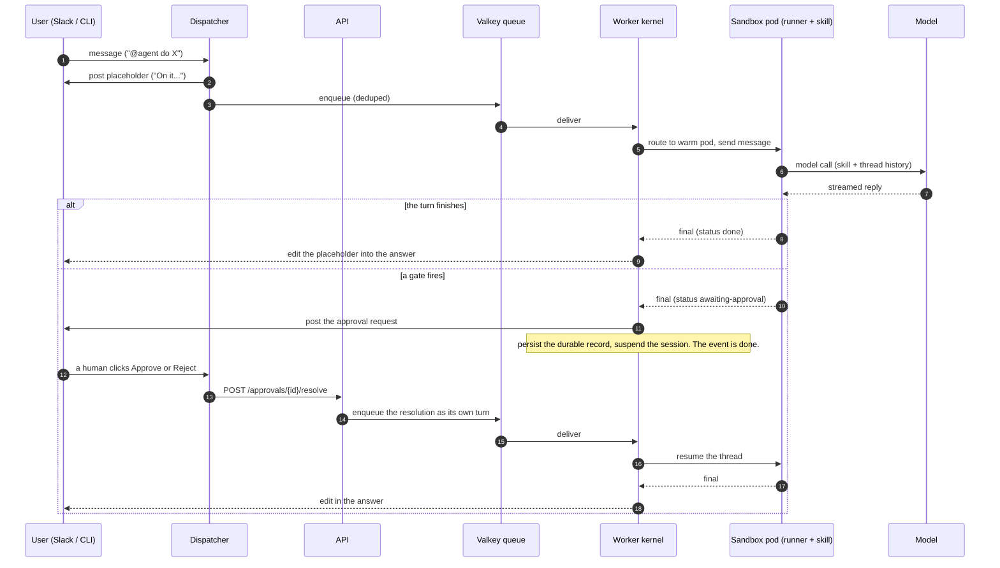
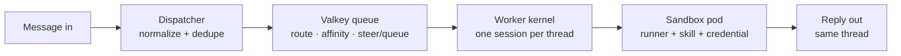

# Message flow: how a message comes in and a reply goes out

This is the core loop. Everything else in Curie (the UI, git-flow, evals,
observability) is machinery around this one path: **a message comes into the
system, an agent handles it, and a reply goes back to the same thread.**

## The one-sentence version

A message arrives on a channel, the dispatcher normalizes it and drops it on a
queue, the worker routes it to a sandbox pod running the right skill, the agent
inside that pod calls the model and streams an answer back, and the worker edits
that answer into the thread the message came from.

## The round trip

Note the shape of the suspended branch: the approval resolution is **not** the
same turn waking up. The original event **completes** at
`SessionStatus.AWAITING_APPROVAL`, and the human's click arrives later as its
own queued turn
(`apps/worker/src/curie_worker/kernel.py::Kernel._pause_for_approval`). That is what lets the
suspension outlive the pod, the worker, and a restart.

The click does **not** go straight from the dispatcher to the queue. The
dispatcher only forwards the decision to the API
([`approval_actions.py`](../../apps/dispatcher/src/curie_dispatcher/approval_actions.py)::`ApprovalResolveClient`),
and the API's
[`approvals.py`](../../apps/api/src/curie_api/routers/approvals.py)::`resolve_approval`
is what claims the resolution (resolve-once) and enqueues the resume turn. The
authorizer runs there, server-side, so the enqueue happens only after the
decision is claimed and audited — which is why the API, not the dispatcher, is
the component to look at when a click does not wake a session.

## The pieces, in the order a message hits them

### 1. The channel is pluggable — on the way in, not on the way out

Today a message comes from **Slack** (Socket Mode) or the **CLI** (`curie
local message` / `curie skill message`, which posts a synthetic event onto the
same queue). The dispatcher's whole job is to turn either of those into one
normalized queue event.

**Be precise about how far that goes.** The per-turn payload *is*
channel-neutral: `QueuedTurn` lives in `aci-protocol` and carries no Slack in
it, so the worker genuinely does not care where a turn came from. The **binding
surface is not**. [The catalog](../interfaces.md) grades this seam **`C` with
`impls: 1`** and is blunt about the leakage: egress still assumes Slack's
edit-in-place `chat.update` reply shape, and Slack typing reaches the control
plane. Email, Teams, or a Jira comment are the same integration point *later* —
after a channel-neutral post/update sink exists, not today. See
[`docs/interfaces/channel-ingress/INTERFACE.md`](../interfaces/channel-ingress/INTERFACE.md).

### 2. Valkey routes and dedupes

Valkey (a Redis-compatible store) is the traffic controller. It dedupes retried
deliveries, and it holds the **affinity** rules that decide whether this message
goes to a **new** sandbox pod or an **existing** one. Affinity matters because of
caching and steering (below): a follow-up in a live thread must reach the exact
pod already working on it.

### 3. The worker builds (or reuses) a sandbox pod

The worker owns **one live session per thread**. For a new thread it starts a
**sandbox pod** — a Kubernetes-isolated container that is, on its own, just a
bare runner (Claude Code). The pod is assembled at request time:

- pull the **runner** image (Claude Code),
- inject the **skill bundle** for this channel, fetched from RustFS (blob store),
- inject the **credential** and the **thread history**.

That assembled environment is the agent. It runs, emits an answer, and the
worker routes the answer back to the thread.

### 4. Warm pods (the 1-hour rule — and the 24-hour one)

A pod stays warm for about an hour after its last turn. Send a follow-up seven
minutes later and the same warm pod handles it (prompt cache intact). Come back
to yesterday's thread and the old pod is gone, so the worker starts a fresh one
and rehydrates the history.

There are **two** TTLs, and the difference is the approval story
([`apps/worker/src/curie_worker/sandbox/types.py`](../../apps/worker/src/curie_worker/sandbox/types.py)):

| Route | Default | Why |
|---|---|---|
| Live (`route_ttl_seconds`) | `3600` (1h) | After expiry the claim is an orphan and `reap_orphans()` deletes it. |
| Suspended (`suspended_route_ttl_seconds`) | `86400` (24h) | A route suspended on an approval waits far longer: the thread may come back tomorrow, because a human has to click. |

An approval that had to resolve inside the live hour would be a gate that
expires faster than a person reads Slack. A separate, longer suspended TTL is
what makes the human-in-the-loop pause real rather than decorative.

## Steering vs. queuing

While a turn is running, a follow-up message is **steered** into the live turn
(same as typing a new message to Claude Code mid-task) rather than waiting for it
to finish. That is the default. If the turn happens to finish first, the worker
just opens a fresh turn on the same idle pod — so from the user's side steering
and queuing look the same.

This is why routing to the *right* pod matters: you can only steer a turn if you
know which pod is running it.

## Where this lives in the code

| Step | Code |
|---|---|
| Slack ingress, dedupe, placeholder, enqueue | [`apps/dispatcher/`](../../apps/dispatcher) |
| CLI channel + synthetic event | [`cli/src/chat.rs`](../../cli/src/chat.rs) |
| Queue, thread locks, affinity | [`apps/worker/src/curie_worker/`](../../apps/worker/src/curie_worker) |
| Sandbox pod substrate | [`apps/worker/src/curie_worker/sandbox/`](../../apps/worker/src/curie_worker/sandbox) |
| The agent inside the pod | [`runner/`](../../runner) — see [the ACI](aci.md) |

For the low-level version (dedupe keys, consumer groups, the finish-race and
crash-recovery invariants), see [`ARCHITECTURE.md` §4](../../ARCHITECTURE.md).
For the pods themselves, see [the Kubernetes architecture](kubernetes.md).
